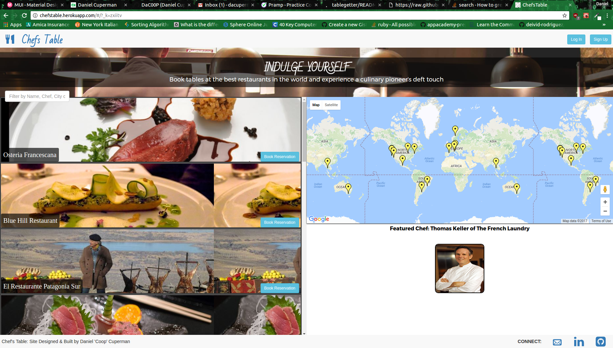

# ChefsTable
A full-stack web application inspired by AirBNB & OpenTable.



ChefsTable gives the user access to faux-reservations, reviews, and food photography from a curated selection of the world's best restaurants. It is comprised of a two-page architecture system, which is achieved using React.js, Ruby on Rails and a Postgres database. Full site developed in two weeks.

Check out ChefsTable [live here][production].

[production]: https://chefstable.herokuapp.com/#/?_k=tu368m

## Features and Implementation


### Authentication: Fast & Easy
- Employs front-end authentication for faster login and sign-up.
- Stores only a hash of a user's password, utilizing the BCrypt gem to encrypt.
- Requires login only to book reservations - full site navigation is allowed whilst not signed in.

### See Where You'll Eat: Fully Interactive Google Map with Marker Highlighting

- Utilizes the Google Maps API in a React Component to allow the user to see restaurant locations.
- Disables mouse-wheel scrolling in the Map in order not to disrupt user experience while scrolling on page.
- Zooming in on the Map will narrow the index to whichever restaurants are visible.
- Highlights a Restaurant Map Marker by inducing opacity on all other markers when the restaurant is moused over in the Index:

  


### Reservation Booking: Pick Your Place, Date, Seating Time, and Give Special Instructions
- Booking is accomplished via a Finalization Modal, once the Date & Time have been chosen via integrated React components.
- A Finalize Modal is then used to confirm all user details, and give optional input fields for Special Instructions & Allergies.
- Overbooking is prevented on the back-end with a custom validation:
    ```ruby
    # reservation.rb
    validate :over_capacity?

    ...

    protected

    def over_capacity?
      not_overbooked = (Reservation.where(restaurant_id: self.restaurant_id)
                      .where(time: self.time)
                      .where(date: self.date)
                      .sum(:party_size) + self.party_size
                        ) <= (Restaurant.find(self.restaurant_id).capacity)

      unless not_overbooked
        errors[:base] << "Request conflicts with existing approved request"
      end
    end
    ```

### Filtering Map & Index: Active Search Bar Utilized to Narrow Your Reservation Choices
- The Restaurant Index has two filtering options:
  - 1) An active filter based on a search bar, which updates the results with every character typed.

  - 2) The zoom function on the map, which narrows the results based on the bounds of the map.
    - Active filtering is accomplished via a single ActiveRecord query:
    ```ruby
    # searches_controller.rb
    def search_for_restaurants(query)
      query = ["%#{query}%", "%#{query}%", "%#{query}%", "%#{query}%"]
      Restaurant.where("name ILIKE ? OR
                        chef ILIKE ? OR
                        cuisine ILIKE ? OR
                        city ILIKE ?",
                         *query )
    end
    ```
    - Filter in Use
    


## Ongoing Improvements

### Utilize Auto-Scrolling to Move the Index to the Position of the Restaurant that was Clicked on the Map
  - When a map marker is clicked on, the Restaurant Index should scroll to that restaurant's position. A tooltip should also open on the map marker indicating that the user can click the tooltip to go directly to the show page.
  - Additionally, the user should be presented for an option to view the Google Street View of the location that the Restaurant is at.

### Center in on the map when the index item is Clicked
  - When the Restaurant Index Item is clicked  on, the Restaurant will be set as the new center of the map, and the marker will remain highlighted for extended time.
