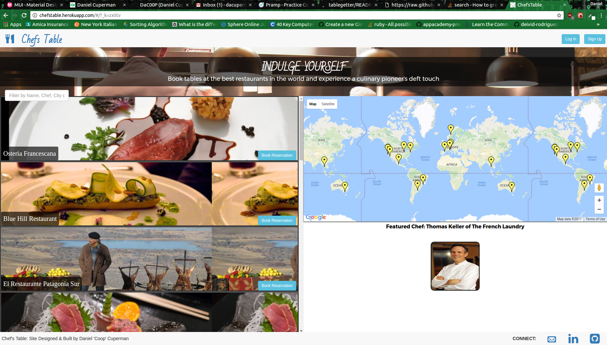
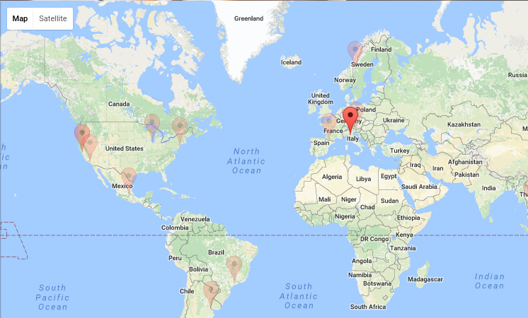

# ChefsTable
A full-stack web application inspired by AirBNB & OpenTable.



ChefsTable gives the user access to faux-reservations, reviews, and food photography from a curated selection of the world's best restaurants. It is comprised of a two-page architecture system, which is achieved using React.js, Ruby on Rails and a Postgres database. Full site developed in two weeks.

Check out ChefsTable [live here][production].

[production]: https://chefstable.herokuapp.com/#/?_k=tu368m

## Features and Implementation


### Authentication: Fast & Easy
- Employs front-end authentication for faster login and sign-up.
- Stores only a hash of a user's password, utilizing the BCrypt gem to encrypt.
- Requires login only to book reservations - full site navigation is allowed whilst not signed in.

### See Where You'll Eat: Fully Interactive Google Map with Marker Highlighting

- Utilizes the Google Maps API in a React Component to allow the user to see restaurant locations.
- Disables mouse-wheel scrolling in the Map in order not to disrupt user experience while scrolling on page.
- Zooming in on the Map will narrow the index to whichever restaurants are visible.
- Highlights a Restaurant Map Marker by inducing opacity on all other markers when the restaurant is moused over in the Index:

  


### Reservation Booking: Pick Your Place, Date, Seating Time, and Give Special Instructions
- Booking is accomplished via a Finalization Modal, once the Date & Time have been chosen via integrated React components.
- A Finalize Modal is then used to confirm all user details, and give optional input fields for Special Instructions & Allergies.
- Overbooking is prevented on the back-end with a custom validation:
    ```ruby
    # reservation.rb
    validate :over_capacity?

    ...

    protected

    def over_capacity?
        if self.party_size == nil
          errors[:base] << "You have not properly selected a Party Size for your reservation, please try again"
          return
        end

        current_bookings = Reservation.where(restaurant_id: self.restaurant_id)
                           .where(time: self.time)
                           .where(date: self.date)
                           .sum(:party_size) + self.party_size

        capacity = Restaurant.find(self.restaurant_id).capacity

        unless current_bookings <= capacity
          errors[:base] << "Request conflicts with existing approved request"
        end
      end
    ```

### Filtering Map & Index: Active Search Bar Utilized to Narrow Your Reservation Choices
- The Restaurant Index has two filtering options:
  - 1) An active filter based on a search bar.

  - 2) The zoom function on the map, which narrows the results based on the bounds of the map.
    - Active filtering is accomplished via varying methods - if the below scope initially returns results, those results are used. Otherwise, a standard iLike search is utilized to make sure the user gets any potential results that the PostGresQL full text search may not return:
    ```ruby
    # restaurant.rb
    scope :search, -> (query) do
        query = ["%#{query}%", "%#{query}%", "%#{query}%", "%#{query}%"]
        Restaurant.where("name ILIKE ? OR
                          chef ILIKE ? OR
                          cuisine ILIKE ? OR
                          city ILIKE ?",
                           *query )
      end


      scope :full_search, -> (query) do
        Restaurant.full_search_method(query)
      end


      def self.full_search_method(query)
        sanitized_query = sanitize_sql_array(["plainto_tsquery(?)", query])
        sql_query = <<-SQL
          full_search_text @@ #{sanitized_query}
        SQL
        Restaurant.where(sql_query)
      end

    ```
    - Filter in Use
    


## Ongoing Improvements

### Utilize Auto-Scrolling to Move the Index to the Position of the Restaurant that was Clicked on the Map
  - When a map marker is clicked on, the Restaurant Index should scroll to that restaurant's position. A tooltip should also open on the map marker indicating that the user can click the tooltip to go directly to the show page.
  - Additionally, the user should be presented for an option to view the Google Street View of the location that the Restaurant is at.
